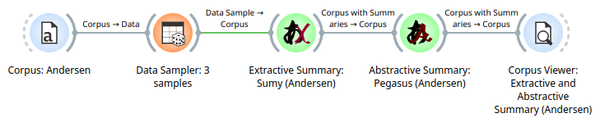
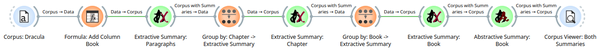

# Chapter 9: Text Summarization

## Learning Objectives

By the end of this chapter, you will be able to:

- Understand the difference between extractive and abstractive summarization.
- Apply automatic summarization to documents using Orange and the `orange3-nlp` extension.
- Explore strategies for scaling summarization workflows to large corpora.
- Evaluate summaries using key heuristics and human judgment.

---

## 9.1 What is Text Summarization?

Text summarization is the task of automatically generating a concise and coherent version of a longer document while preserving its key information.

There are two main types:

- **Extractive summarization**: Selects and joins key sentences or phrases from the original text.
- **Abstractive summarization**: Generates new sentences that paraphrase and condense the original content (more similar to how humans summarize).

Use cases include:

- News aggregation  
- Scientific article previews  
- Legal and compliance documentation  
- Social media monitoring  

---

## 9.2 Using Summarization Widgets in Orange

Several widgets provided by `orange3-nlp` will help you explore summarization:

- **Extractive Summary** (extractive)
- **Abstractive Summary** (if transformer support is configured)
- **Corpus**
- **Corpus Viewer** (optional)

### Workflow Example

1. Use **Corpus** to load `andersen.tab`.
2. Use **Data Sampler** to keep the number of samples to 3 (useful when trying out different inputs)
2. Add **Extractive Summary** to extract sentence-level summaries.
4. Optionally compare with **Abstractive Summary** if supported.
5. Output to **Corpus Viewer**.

---

## 9.3 Extractive vs Abstractive Approaches

| Feature | Extractive | Abstractive |
|--------|------------|-------------|
| Method | Sentence ranking | Language generation |
| Output | Original text fragments | Paraphrased new text |
| Complexity | Low | High |
| Speed | Fast | Slower |
| Accuracy | High for factual precision | More human-like summaries |

Abstractive models typically require transformer-based architectures and more compute. These may be explored more deeply in Chapter 14 using **Large Language Models** with `orange3-ollama`.

---

## 9.4 Scaling Summarization for Large Texts

When summarizing large documents or corpora, consider:

- **Chunking**: Break texts into paragraphs or sections before summarization as many of the summarizers have limits on how much text they can process.
- **Caching and Checkpoints**: Save intermediate results to disk for reusability.
- **Hybrid Summaries**: Summarize paragraphs first, then summarize those summaries. This is a very powerful technique that you may wish to use in your capstone project.  Below, I show an example using [Dracula by Bram Stoker](https://www.gutenberg.org/ebooks/345).

> 💡 In Chapter 14, you will learn how to leverage LLMs via `orange3-ollama` to generate high-quality abstractive summaries even from very large texts.

---

## Lab Exercise 9A: Summarizing News Articles

**Goal**: Generate summaries from long-form news content.

**Steps**:

1. Load `BBC3` using *Datasets*
2. Use *Data Sampler* to select 10 rows.
3. Convert to Corpus, select only Content as text feature
4. Preprocess text → **Extractive Summary**
5. Connect to **Corpus Viewer**
6. Compare:
   - How informative is the summary?
   - Are key facts preserved?
   - How does each summarization framework perform in comprehension and speed?
     - Sumy, Summa, BART, and Ollama (if you have Ollama installed)

---

## Lab Exercise 9B: Compare Summaries of Academic Abstracts

**Goal**: Understand the differences in summarization style and quality.

**Steps**:

1. Load `BBC3` using *Datasets*
2. Use *Data Sampler* to select 10 rows.
3. Convert to Corpus, select only Content as text feature
4. Preprocess and pass through both **Extractive Summary** and **Abstractive Summary**
3. Use **Corpus Viewer** to view side-by-side results
4. Rate each summary’s quality using:
   - Coverage of main idea
   - Fluency
   - Conciseness

---

## Comprehension Questions

1. What are the core differences between extractive and abstractive summarization?
2. When might extractive summarization be preferable?
3. What challenges arise when summarizing very long documents?
4. How can chunking improve summarization workflows?
5. Why might you choose to integrate LLMs for summarization, as we will see in Chapter 14?

---

## Key Terms

- Extractive Summarization  
- Abstractive Summarization  
- Sentence Ranking  

---

## Notes

- Save your workflows as `summarize-news.ows` and `summarize-abstracts.ows`.  
- You can chain summarization with topic modeling or classification tasks.  
- Look ahead to **Chapter 14**, where we will use Large Language Models for advanced summarization tasks.

---

