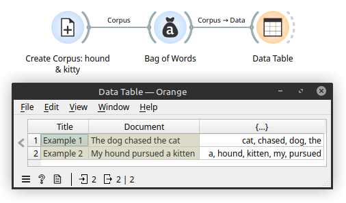
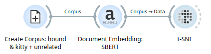
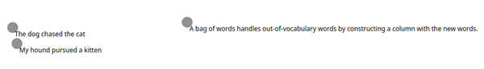

# Chapter 11: Word Embeddings and Vector Representations

## Learning Objectives

By the end of this chapter, you will be able to:

- Understand why word embeddings are used instead of one-hot or count-based vectors.
- Explore how word embeddings group similar words together in space.
- Use Orange to visualize pre-trained word vectors.
- Apply embeddings to cluster or compare words and documents based on meaning.
- Interpret vector relationships through interactive plots and similarity tools.

---

## 11.1 Why Word Embeddings?

Traditional models like bag-of-words or one-hot encodings treat each word as a unique, unrelated symbol. This has several drawbacks:

- **No sense of similarity** between words (e.g., "cat" and "kitten" are unrelated in a one-hot encoding).
- **Sparse and high-dimensional** data that’s inefficient for modeling.

> Think of embeddings like a map of words: words that mean similar things are near each other on the map.

After applying embedding, and including a third, unrelated example, you can see how the embedding bring similiar sentences together.

  

**Word embeddings** solve this by placing words in a continuous vector space where:

- Similar words are **closer together**.
- Directions in space encode **semantic relationships**.

**Sentence embeddings** go a step further and capture the context of how the words are combined into a sentence. This works well for finding paraphrasing of the same concept.

**Document embeddings** try to capture the overall context of a document, often loosing specific sentence-level detail.  This is powerful for finding related documents that have some similarity in topic or purpose.

> While the technologies underpinning these models are facinating, it is easiest to organize the algorithms by purpose.

---

## 11.2 Common Embedding Models and Their Uses

Text embedding models turn words, sentences, or documents into numerical vectors. These vectors are used in many NLP tasks. Below are common use cases and which models are good fits for each.

### 🔍 1. Keyword & Semantic Search

Use when: You want to match a user query to the most relevant document or passage.

**Recommended Models:**
- **E5 (e.g., `e5-small-v2`)** – Trained specifically for search tasks using "query:" and "passage:" prompts.
- **OpenAI's `text-embedding-ada-002`** – High-quality embeddings (requires API).
- **SBERT models (e.g., `all-MiniLM-L6-v2`)** – Fast, effective for short queries and passages.
- **nomic-embed-text** – Open-source alternative to commercial APIs with strong semantic search performance.

**Why**: These models capture *meaning* well, not just keywords, so they can match synonyms or related ideas.

### 📚 2. Document Clustering & Topic Modeling

Use when: You want to group similar texts together automatically (e.g., news articles, support tickets).

**Recommended Models:**
- **SBERT models** – Offer dense embeddings ideal for clustering.
- **E5** – Produces well-separated embeddings useful for grouping.
- **nomic-embed-text** – High-dimensional embeddings good for unsupervised clustering.
- **Doc2Vec** – Simpler model, can still be used for clustering longer texts.

**Why**: You need embeddings that place related documents close together in vector space.

### 🧠 3. Text Classification (e.g., spam detection, sentiment analysis)

Use when: You want to label documents with categories based on their content.

**Recommended Models:**
- **SBERT models** – Good for short to medium text inputs.
- **E5** – Strong zero-shot classification with prompt tuning.
- **Universal Sentence Encoder (USE)** – Easy to use for general tasks.

**Why**: These embeddings can be used directly as features for machine learning classifiers.

### 🧾 4. Semantic Similarity (e.g., duplicate detection, paraphrase identification)

Use when: You want to know if two texts mean the same thing.

**Recommended Models:**
- **SBERT models** – Trained specifically for this task.
- **InferSent** – Earlier model, simple and interpretable.
- **E5** – Also works well when texts are framed appropriately.

**Why**: These models are trained to measure *meaning overlap* rather than exact word matching.

### 🧰 5. General-Purpose Embeddings (All-rounder models)

Use when: You're not sure what task you're doing yet, or want a flexible model.

**Recommended Models:**
- **SBERT (`all-MiniLM-L6-v2`)** – Balanced performance and speed.
- **nomic-embed-text** – Open and versatile, suitable for search, clustering, and more.
- **USE** – Google’s general-purpose model with multilingual support.
- **OpenAI embeddings** – Strong across most tasks but proprietary.

### Summary Table

| Task                      | Best Model Types                            |
|---------------------------|---------------------------------------------|
| Keyword / Semantic Search | E5, OpenAI, SBERT, nomic-embed-text         |
| Document Clustering       | SBERT, E5, nomic-embed-text, Doc2Vec        |
| Text Classification       | SBERT, E5, USE                              |
| Semantic Similarity       | SBERT, InferSent, E5                        |
| General Use               | SBERT, nomic-embed-text, USE, OpenAI        |

---

## 11.3 Using Text Embeddings in Orange

With your custom Orange widgets, the following tools will be available:

### Widgets Used

- **Create Corpus**: Create a corpus for exploration.
- **SBERT Embedder**: Provides an embedder model for sentence-based embedding.
- **Text Embedder**: Uses an embedder model to perfom embedding on a corpus of text.
- **t-SNE**: Visualizes embedding vectors in 2D using t-SNE.

---

## Lab Exercise 11A: Explore Embedding Space

**Goal**: Visualize word clusters and similarities.

**Steps**:

1. Use *Corpus* to load the food-and-country corpus.

| Type | Word |
|------|------|
| food | pizza |
| food | sushi |
| food | taco |
| food | hamburger |
| country | italy |
| country | japan |
| country | mexico |
| country | usa |

2. Connect the new corpus to *Text Embedder*
3. Connect an *SBERT Embedder* into the *Text Embedder*
4. Connect the *Text Embedder* into *t-SNE*.

**Questions**:

- Do semantically related words form tight clusters?
- Are there words that appear far from where you expect? Why?

---

## Lab Exercise 11B: Group Words by Category

**Goal**: Use embeddings to group words into categories without labeling them.

**Steps**:

1. Load a word list with mixed categories (e.g., animals, professions, emotions).
2. Pass it through *Word Embeddings* and then to a *Hierarchical Clustering* widget.
3. Visualize the dendrogram and interpret which clusters were formed.

**Optional**: Use *Distance Map* or *Silhouette Score* to evaluate cluster tightness.

---

## Comprehension Questions

1. What does it mean when two words are "close" in embedding space?
2. How is a word embedding different from a one-hot vector?
3. Why might "good" and "bad" appear near each other in a plot?
4. What are some practical tasks where embeddings are helpful?
5. In what ways can visualizing word vectors help guide your analysis?

---

## Key Terms

- Word Embedding
- Semantic Similarity
- Vector Representation
- Word2Vec
- GloVe
- Embedding Space
- t-SNE / PCA
- Clustering

---

## Notes

- Save your workflow as `word-embeddings.ows`.
- The next chapter will introduce document embeddings and sentence-level semantic search.

---

