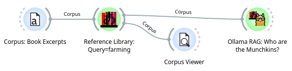
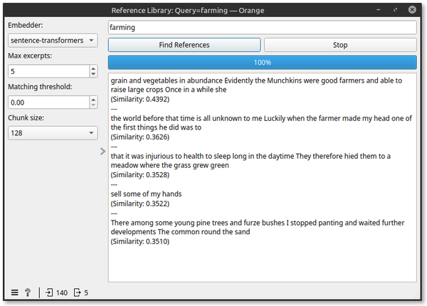
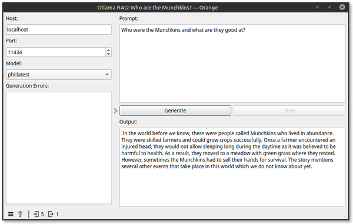

# Chapter 15: Reference Augmented Generation (RAG)

## Learning Objectives

By the end of this chapter, you will be able to:

- Understand the principles of Reference Augmented Generation (RAG).
- Explain why RAG improves the quality and reliability of LLM output.
- Build and query a reference database using Orange and `orange3-nlp` widgets.
- Construct workflows that use retrieved context to guide LLM responses.
- Design and run a RAG pipeline on a topic corpus of your choice.

---

## 15.1 What is Reference Augmented Generation (RAG)?

**Reference Augmented Generation (RAG)** is a method of enhancing large language model (LLM) responses by *providing external documents as supporting context*. Instead of relying solely on the model's training data, RAG:

- **Retrieves** relevant snippets from a document collection (knowledge base).
- **Augments** the prompt to the LLM by including this retrieved content.
- **Generates** a more accurate and grounded answer based on the context.

### Why Use RAG?

LLMs are powerful, but they suffer from two common problems:

- **Hallucination**: Making up facts not grounded in data.
- **Stale knowledge**: Being unaware of recent events or private information.

RAG solves this by giving the model *real documents* to work from. It bridges the gap between retrieval-based search and generative output.

---

## 15.2 High-Level Architecture of RAG

A basic RAG pipeline looks like this:

1. **Input Query**: The user asks a question.
2. **Retriever**: Finds top-k relevant documents from a reference database.
3. **Prompt Construction**: Documents + question are packaged into a prompt.
4. **LLM Response**: The model generates an answer based on the combined context.

> Think of RAG as a “search-then-write” strategy for LLMs.

---

## 15.3 Using RAG in Orange with `orange3-nlp`

The `orange3-nlp` module provides two key widgets to support RAG:

### 🧱 `Reference Library`

- Accepts a set of documents or text rows.
- Builds an **embedding-based vector index**.
- Stores documents and metadata locally for retrieval.
- Returns top matching excerpts from the input documents based on a user query.

### 🔍 `Ollama RAG`

- Accepts a user prompt and reference excerpts from the library.
- Sends the prompt with the input context to the LLM and displays the generated answer.

---

## 15.4 Building a RAG Pipeline in Orange

### Example Workflow

Corpus → Reference Library → Ollama RAG Query → Corpus Viewer

Let's take a look at the Reference Library

In this example, I used sentence-transformers to embed the document and return 5 excerpts at around 128 characters each to the query about "farming".

Certainly! Here's the same information presented as an unordered list for each embedder:

---

* **spaCy (`en_core_web_md`)**

  * **Framework:** spaCy
  * **Vector Size:** 300
  * **Speed:** ⚡ Fast
  * **Accuracy / Relevance:** 🔸 Moderate
  * **Best Use Case:** Lightweight NLP pipelines, fast prototyping
  * **License:** MIT

* **SentenceTransformers (`all-MiniLM-L6-v2`)**

  * **Framework:** sentence-transformers
  * **Vector Size:** 384
  * **Speed:** ⚡⚡ Fast
  * **Accuracy / Relevance:** ✅ Good
  * **Best Use Case:** General-purpose semantic search and RAG
  * **License:** Apache 2.0

* **E5 Small v2 (`intfloat/e5-small-v2`)**

  * **Framework:** HuggingFace Transformers
  * **Vector Size:** 384
  * **Speed:** ⚡ Medium
  * **Accuracy / Relevance:** ✅✅ Very Good
  * **Best Use Case:** Context-aware RAG and question answering
  * **License:** Apache 2.0

* **Ollama (`nomic-embed-text`)**

  * **Framework:** Ollama (local LLM)
  * **Vector Size:** 768
  * **Speed:** ⚠️ Slower
  * **Accuracy / Relevance:** ✅✅✅ Excellent (contextual + deep)
  * **Best Use Case:** High-accuracy local embeddings with long-context support
  * **License:** MIT

In the Ollama RAG widget, I used the Phi LLM to ask it who the Munchkins were.  The answer heavily focused on farming.  Note the relationship between what was asked of the reference library and what was asked of the LLM.

---

## Lab Exercise 15A: Deep-Dive RAG Workflow

### Objective

Create a RAG system that answers questions based on a curated dataset of technical articles (e.g., scientific summaries, policy reports, or company documentation).

---

### Dataset Options

- Public science summaries
- Open government reports
- News archives
- A custom set of `.txt` or `.csv` files with paragraph-level entries

---

### Instructions

1. **Prepare the Corpus**  
   Use the `File` widget to load your dataset. You may need to preprocess the data to ensure clean paragraph-style chunks (e.g., using a `Corpus Editor` widget).

2. **Build the Reference Database**  
   Connect the cleaned text to the `Ollama Reference Database` widget.
   - Choose a model for embeddings (e.g., `mistral` or `nomic-embed-text`).
   - Store the database locally under a recognizable name.

3. **Query Using RAG**  
   Add a `Text Input` widget and type in specific questions related to the dataset.
   - Connect it to the `Ollama RAG Query` widget.
   - Link the RAG Query to the same database you built.
   - Observe the retrieved context and generated answer.

4. **Inspect the Workflow Output**  
   Connect a `Corpus Viewer` or `Text Display` widget to view the results.
   - Optionally, inspect the retrieved documents to see if they match the question intent.

---

### Challenge Goals

- Evaluate whether the answers truly reflect the source material.
- Try tweaking your query to trigger different retrieval behavior.
- Change the number of retrieved passages (top-k) and observe the output change.
- Bonus: Try asking a question where you *know* the answer isn't in the documents. What happens?

---

## Comprehension Questions

1. What role does the embedding model play in the RAG pipeline?
2. Why might an LLM still hallucinate, even in a RAG setup?
3. What are the trade-offs between retrieving more context vs. keeping the prompt short?
4. How does RAG differ from traditional document search?

---

## Key Terms

- Reference Augmented Generation (RAG)
- Embedding
- Contextual Prompt
- Retrieval-Augmented Model
- Vector Database
- Top-k Search

---

## Notes

- Be sure to experiment with different document types.
- You can inspect saved vector databases on disk via the `ollama-embedding-store` path.
- Save your workflow as `rag-techdocs.ows`.

---

